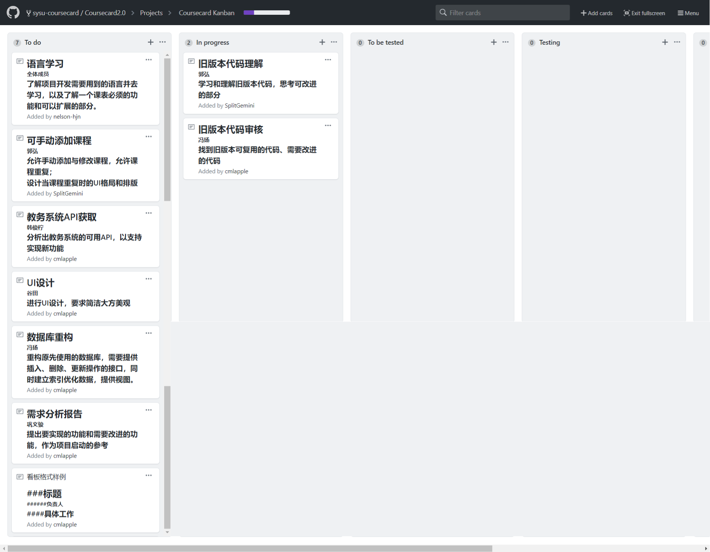
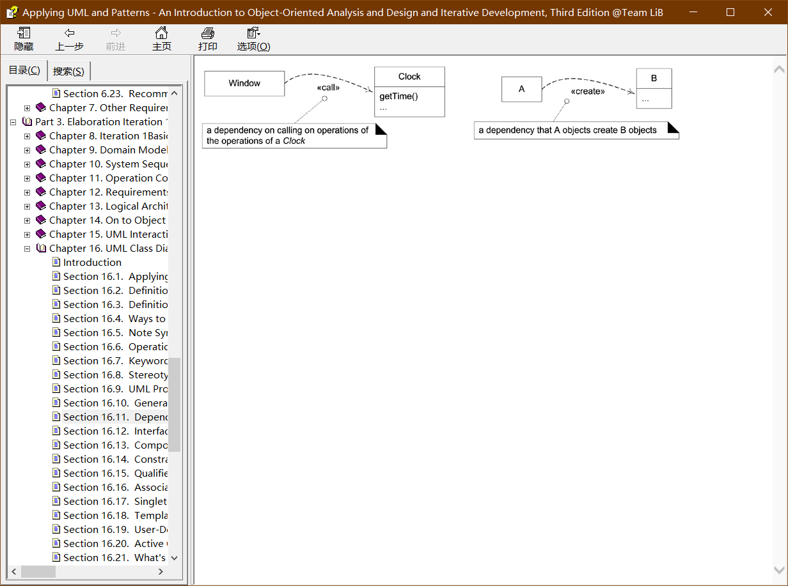
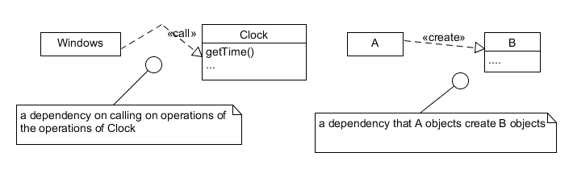

 [Back](./)
# 系统分析与设计 HW 2

{:.no_toc}
* 目录
{:toc}

## 1.简答题
### 1.1 用简短的语言给出对分析、设计的理解。
分析就是尽可能全面的罗列整个项目所需要的各方面步骤和相关细节，确定出一个完整的实体概念，是对问题和需求的调查研究
设计就是对已有概念的逻辑和结构的编排和架构，是满足需求的解决方案
### 1.2 用一句话描述面向对象的分析与设计的优势。
面向对象的分析与设计首先确保每个对象的独立性，让分析与设计可以排除其他对象的干扰而专注与某一个对象的正确实现，同时也对调试与测试给予便利，让整个项目易于理解和维护
### 1.3 简述 UML（统一建模语言）的作用。考试考哪些图？
* #### UML 作用：
 - 捕获需求内容（用于需求分析）：描述系统提供的的功能以及和外部的联系。
 - 捕获逻辑结构（用于分析、设计）：描述某一时刻的状态以及类的定义和它们的关系。
 - 捕获行为（用于分析、设计）：按时间顺序或连接关系描述对象间的交互行为；描述一个对象的状态转换；描述工作流和时间流以及算法。
 - 捕获实现执行环境（用于设计）：描述源代码和模块的结构以及文件间的依赖关系。
 - 用符号来表示说明问题的风险是显而易见的，使用UML绘图可以帮助我们更为便利的观察全景，发现与分析软件元素间的联系，同时允许我们忽略旁支末节。

* ####  考试的重点图形:图形化的表示机制，十多种视图，分4类：
 - 用例图：用户角度：功能、执行者
 - 静态图：系统静态结构
   - 类图：概念及关系
   - 对象图：某种状态或时间段内，系统中活跃的对象及其关系
  - 包图：描述系统的分解结构
 - 行为图：系统的动态行为
   - 交互图：描述对象间的消息传递
     - 顺序图：强调对象间消息发送的时序
     - 合作图：强调对象间的动态协作关系
  - 状态图：对象的动态行为。状态-事件-状态迁移-响应动作
  - 活动图：描述系统为完成某功能而执行的操作序列
 - 实现图：描述系统的组成和分布状况
   - 构件图：组成部件及其关系
   - 部署图：物理体系结构及与软件单元的对应关系

### 1.4  从软件本质的角度，解释软件范围（需求）控制的可行性
软件的本质包括复杂性、一致性、可变性和不可视性，软件范围多数情况下对于客户和开发者都是模糊的，这形成软件产品与其他产品不同的开发过程。因此，范围管理是软件项目管理的重中之重！（软件内在本质固然是软件危机的根源，同时也带来开发管理的特色，产品设计与开发者有更大的话语权，这是双刃的！）掌握 20% 软件工程基础知识有助于提升 80% 项目的效率和质量
## 2. 项目管理实践

### 2.1 看板使用练习（提交看板执行结果贴图，建议使用 Git project）

每个人的任务是明确的。必须一周后可以看到具体结果
每个人的任务是1-2项
至少包含一个团队活动任务
### 2.2 UML绘图工具练习（提交贴图，必须使用 UMLet）
请在 参考书2 或 教材 中选择一个类图（给出参考书页码图号）
选自[Craig_Larman]_Applying_UML_and_Patterns(z-lib.org).chm版 Section 16.11 Figure 16.11
原版

测试
