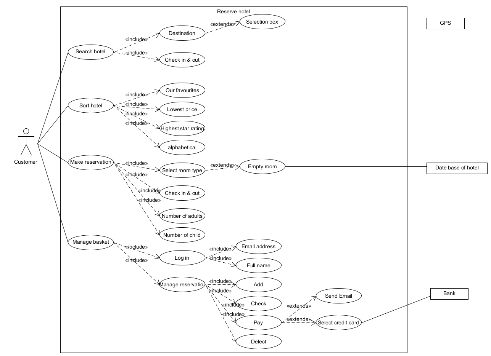
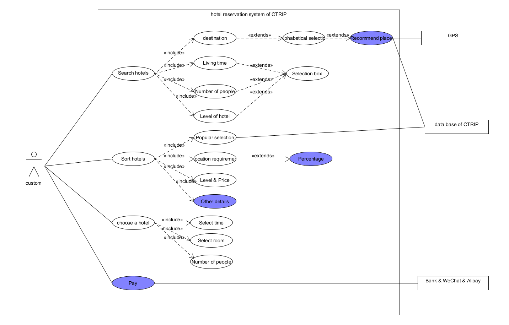

 [Back](./)
# 系统分析与设计 HW 6

{:.no_toc}
* 目录
{:toc}

## 1、简答题
### 1.用例的概念
* 用例是指一组有关于用户使用一个系统实现一个目标的成功或失败的场景。用例指明了系统将要实现的功能或行为需求。
 
### 2.用例和场景的关系？什么是主场景或 happy path？
* 用例和场景的关系：场景是用户和系统之间的一系列动作的集合，每一个用例包括了多个场景。
* 主场景：主场景对应于系统主要的交互，通常是指成功的场景。

### 3.用例有哪些形式？
* 三种常见的用例形式：简要格式、简便格式、完整正式格式
   * 简要格式（Brief）：简洁的总结，通常是主要的成功场景
   * 简便格式（Casual）：覆盖多个场景的几个段落
   * 完整正式的格式（Fully）：所有的步骤和变化都写得很详细
* 其他用例形式：双列表格式、单列表格式、RUP格式

### 4.对于复杂业务，为什么编制完整用例非常难？
 复杂业务其业务流程较为复杂，业务较为繁琐，业务流程较多，因此对应于很多复杂的场景，用户交互的细节和相对应的支撑较多，较难实现用户与服务之间的完整与协调。

### 5.什么是用例图？
 用例图是指由参与者、用例,系统边界以及它们之间的关系构成的用于描述系统功能的图，是表示系统上下文的一张图片，显示了系统的边界，展示了与系统交互的外部对象，描述了系统的使用方法。

### 6.用例图的基本符号与元素？
 基本元素与符号：参与者、用例、关联关系、包含关系、扩展关系、泛化关系

### 7.用例图的画法与步骤
##### 1. 需求识别
   * 确定研究对象

##### 2. 确定参与者
   * 谁将使用该系统的主要功能。  
   * 谁将需要该系统的支持以完成其工作。 
   * 谁将需要维护、管理该系统，以及保持该系统处于工作状态。  
   * 系统需要处理哪些硬件设备。  
   * 与该系统那个交互的是什么系统。 
   * 谁或什么系统对本系统产生的结果感兴趣

##### 3. 识别用例
   * 确定需要研究的系统中的用例和服务，区分用户级别的用例和子用例

##### 4. 建立用例与参与者（Actor）之间的关系
   * 包含关系
   * 泛化关系
   * 关联关系
   * 扩展/延伸关系

### 8.用例图给利益相关人与开发者的价值有哪些？
1. 用例强调了用户的目标，使用户可以更好的参与系统的设计中，保证系统的设计是符合用户需求的。
2. 用例图明确了系统的业务范围、服务对象（角色）、外部系统与设备。
3. 用例图利于利益相关人了解系统的功能特点和服务。
4. 用例图利于开发者明确需要实现的功能。

## 2、建模练习题（用例模型）
* #### 选择2-3个你熟悉的类似业务的在线服务系统（或移动 APP），如定旅馆（携程、去哪儿等）、定电影票、背单词APP等，分别绘制它们用例图。并满足以下要求： 
   * 请使用用户的视角，描述用户目标或系统提供的服务
   * 粒度达到子用例级别，并用 include 和 exclude 关联它们
   * 请用色彩标注出你认为创新（区别于竞争对手的）用例或子用例
   * 尽可能识别外部系统和服务

	Asg_RH文档，reverse hotel用例图：

	携程预订酒店用例图：

* #### 然后，回答下列问题： 
##### 1. 为什么相似系统的用例图是相似的？

相似系统提供的服务是相似或相同的，面对的用户和用例是相似的，而用例之间的关系是由服务确定的，故也是相似的。为了提供相似的服务，相似的系统之间的用例图也是相似的。

##### 2. 如果是定旅馆业务，请对比 Asg_RH 用例图，简述如何利用不同时代、不同地区产品的用例图，展现、突出创新业务和技术

比较上述的携程与Asg_RH用例图可看出，携程预定酒店系统具有创新的部分（标注为蓝色），首先，便是酒店搜寻时，具有推荐热门地点用例。其次，排序酒店用例中，便有位置选择人数百分比的用例。然后，更有许多新加的、实用的细节排序功能。最后，在支付时，更有时代特点的线上支付功能。
##### 3. 如何利用用例图定位创新思路（业务创新、或技术创新、或商业模式创新）在系统中的作用

通过判断创新点在用例图中的位置。如果创新点属于直接与用户关联的用例，则在系统中的作用很重要。如果是子用例，则看与父用例的关系，如果是包含关系，则作用较大，如果是扩展用例，则作用较小。

##### 4. 请使用 SCRUM 方法，选择一个用例图，编制某定旅馆开发的需求（backlog）开发计划表

| ID | Name|	Imp| Est |	How to demo |
| --- | --- | --- | --- | --- |
| 1	| 搜索旅馆 |	90|	5|	选择城市、日期、关键字|
| 2	| 预订旅馆 |	100|3|	选择酒店、进入详情页、查看信息房型后点击预订按钮 |
| 3	|确认订单 |	80|	6|	查看信息，填写入住信息|
| 4	|支付订单 |	60|	10|	选择付款方式，进行付款|

##### 5. 根据任务4，参考 使用用例点估算软件成本，给出项目用例点的估算
对用例分配权重的标准是：

